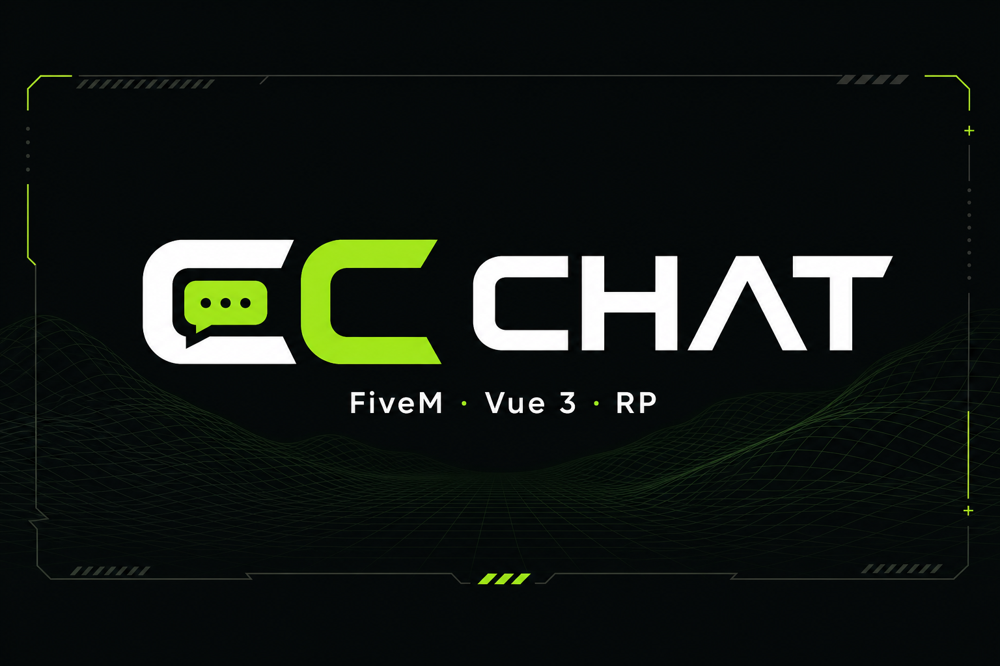
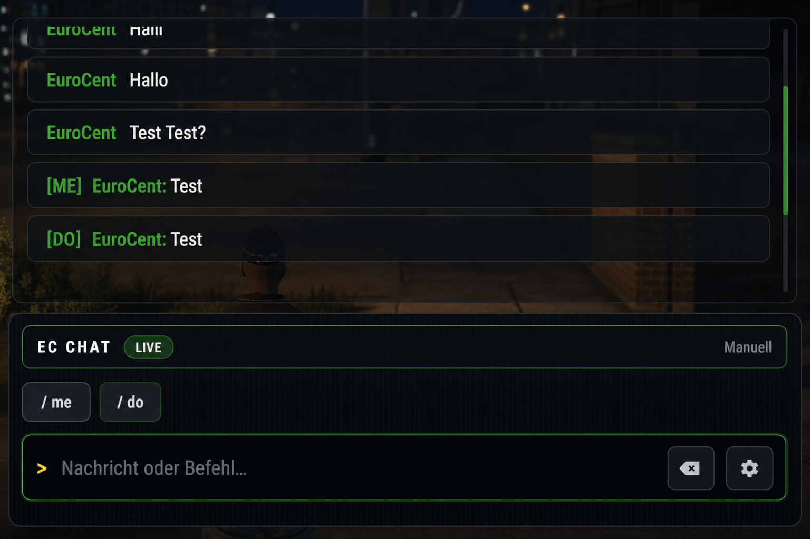

<p align="center">
  
</p>

<p align="center">
  
</p>

<h1 align="center">EC Chat</h1>

<p align="center">
  <strong>Professioneller FiveM-Chat</strong> — RP-tauglich, staff-sicher, konfigurierbar.
</p>

<p align="center">
  <a href="https://github.com/EuroCent82/ec_chat/releases"></a>
  <a href="https://github.com/EuroCent82/ec_chat/releases/latest"></a>
  <a href="./LICENSE"></a>
  <a href="https://github.com/EuroCent82/ec_chat"></a>
</p>

<p align="center">
  Resource <code>ec_chat</code>
  <br />
  Copyright © 2026 <strong>GameNetWorX</strong> (<a href="https://github.com/EuroCent82">EuroCent82</a>)
</p>

---

## Überblick

**EC Chat** ist ein moderner Chat für FiveM-Server — kompatibel mit gängigen Frameworks und euren bestehenden Chat-Befehlen.

| Bereich | Kurzbeschreibung |
| --- | --- |
| **Oberfläche** | Dark-Industrial-UI, Presets, frei positionierbar |
| **RP** | `/me` · `/do` mit Rechte-Config, 3D-Overhead, Schnellbuttons |
| **Staff** | Eigene Aliase, rot markiert, nur für Berechtigte sichtbar |
| **Historie** | HUD mit Auto-Fade, Protokoll-Popup mit Zeitstempel |
| **Datenbank** | Item-Vorschläge, optionales Chat-Protokoll in MySQL |
| **Kompatibilität** | ESX · ox_inventory · klassischer Chat |

<p align="center">
  
</p>

---

## Installation

### Voraussetzungen

| Komponente | Hinweis |
| --- | --- |
| **FiveM-Server** | Aktueller Server-Build |
| **MySQL** | [oxmysql](https://github.com/overextended/oxmysql) (empfohlen) oder **mysql-async** — nur für Datenbank-Features |
| **Abhängigkeiten** | Kein Pflicht-Dependency; ohne MySQL läuft der Chat, DB-Features entfallen |

### Release-ZIP (empfohlen)

1. Neuestes Release laden: **[github.com/EuroCent82/ec_chat/releases](https://github.com/EuroCent82/ec_chat/releases)**
2. `ec_chat.zip` entpacken nach `resources/[scripts]/ec_chat/`
3. Optional: `sql/chat_history.sql` ausführen, wenn Chat-Protokoll in der Datenbank gewünscht ist
4. `config.lua` anpassen — siehe [`readme_config.md`](./readme_config.md)
5. In **`server.cfg`**:

   ```cfg
   ensure oxmysql
   ensure ec_chat
   ```

---

## Bedienung

| Aktion | Standard |
| --- | --- |
| Chat öffnen | **T** (in den Spiel-Einstellungen änderbar) |
| Eingabe-Historie | **↑** / **↓** |
| Befehlsvorschläge | **Strg** + **↑** / **↓** · **Tab** zum Durchschalten |
| HUD-Historie ein / aus | **`/chat on`** · **`/chat off`** (Streamer-Modus) |
| Protokoll-Fenster | **Uhr-Icon** in der Chat-Leiste |
| Staff-Chat | z. B. **`/a Nachricht`** (nur mit Berechtigung) |

---

## Konfiguration

Alle Optionen in **`config.lua`** — vollständig dokumentiert auf Deutsch:

**→ [`readme_config.md`](./readme_config.md)**

| Block | Inhalt |
| --- | --- |
| `Me`, `Do` | RP-Befehle, Länge, Overhead, Berechtigungen |
| `Chat`, `StaffChat` | Chat-Verhalten, Team-Chat |
| `SQL` | Item-Vorschläge aus der Datenbank |
| `Ui` | Branding, HUD-Historie, Sounds, Auto-Fade |
| `ChatHistoryDatabase` | Persistentes Server-Protokoll |

Position und Fenster im Spiel: [Anhang A in readme_config.md](./readme_config.md#anhang-a--ui-einstellungen-nicht-in-configlua).

---

## Funktionen

<details>
<summary><strong>Chat & Eingabe</strong></summary>

- Autocomplete für Befehle und Vorschläge
- Eingabe-Historie per **↑** / **↓**
- Schnellbuttons für `/me` und `/do`

</details>

<details>
<summary><strong>RP & Staff</strong></summary>

- **`/me`** und **`/do`** — je Befehl konfigurierbar
- Staff-Aliase (`/a`, `/t`, …) nur für berechtigte Spieler sichtbar
- Darstellung: **rot** im Chat und in der Historie

</details>

<details>
<summary><strong>Historie & Datenbank</strong></summary>

- HUD-Nachrichten mit Auto-Fade (ESX-ähnlich)
- Protokoll-Popup: `[DD.MM.YYYY HH:mm] - [Kanal] USER: Nachricht`
- Optionales Chat-Protokoll in MySQL für Support

</details>

---

## Updates

Beim Serverstart prüft EC Chat, ob eine neuere Version verfügbar ist, und gibt einen Hinweis in der Server-Konsole aus.

**Releases:** [github.com/EuroCent82/ec_chat/releases](https://github.com/EuroCent82/ec_chat/releases)

---

## Lizenz

Dieses Projekt steht unter der **[MIT License](./LICENSE)**.

Copyright © 2026 **GameNetWorX** ([EuroCent82](https://github.com/EuroCent82))

---

<p align="center">
  
  <br />
  <strong>EC Chat</strong> · FiveM · RP-ready
  <br />
  <a href="./readme_config.md">Konfiguration</a> ·
  <a href="https://github.com/EuroCent82/ec_chat/releases">Releases</a> ·
  <a href="./LICENSE">Lizenz</a>
</p>
